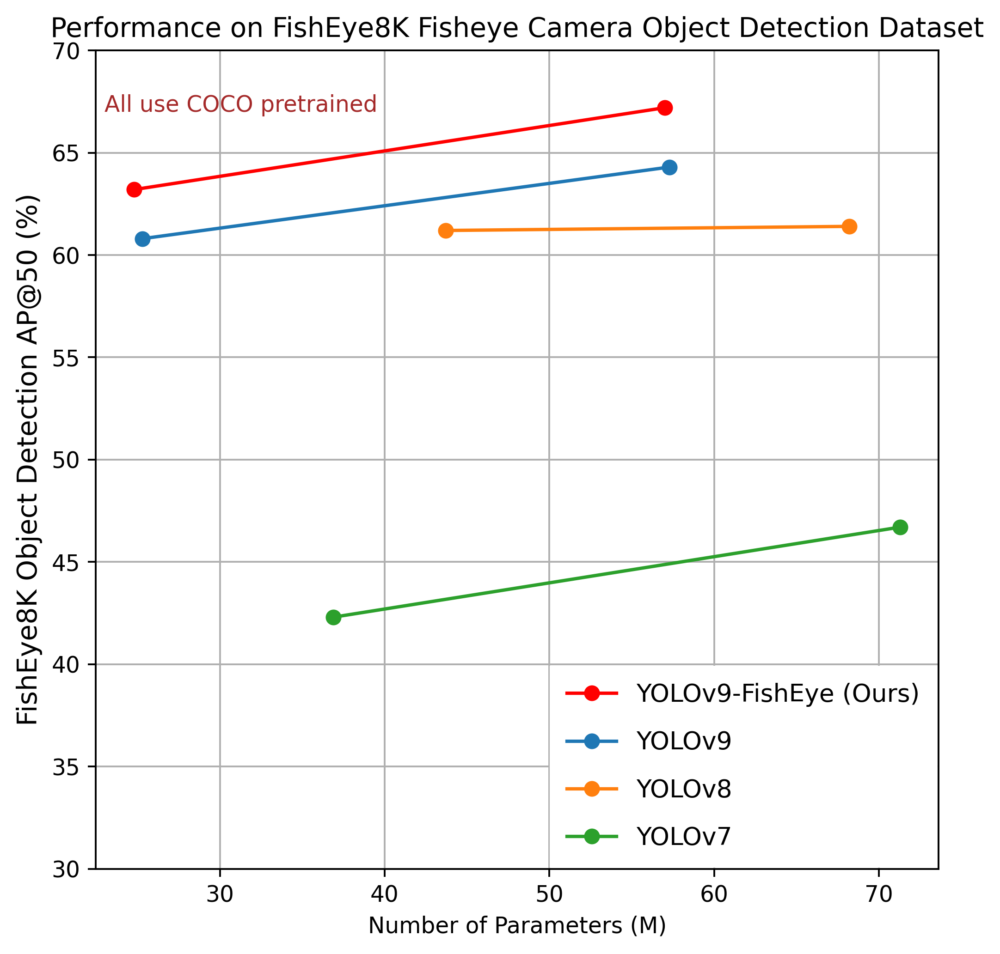
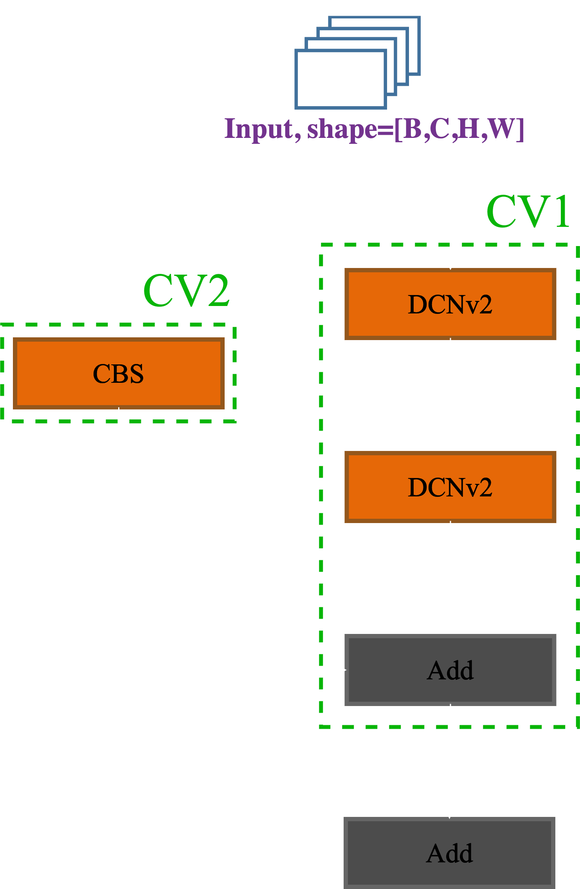
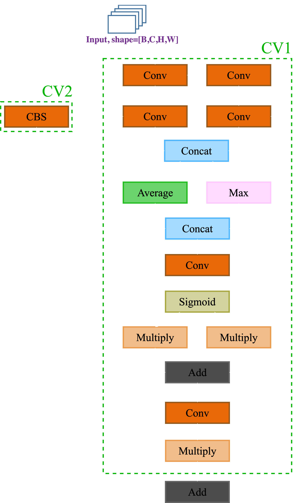
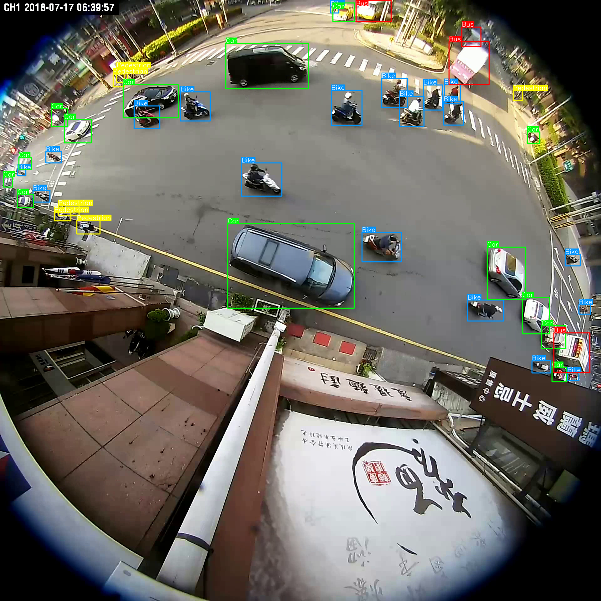

<h1 style="text-align: center;">YOLOv9-FishEye</h3>
<!-- # YOLOv9-FishEye -->

This repository is the official implementation of paper  [YOLOv9-FishEye: Improving method for fisheye camera object detection](https://github.com/tuansunday05/fe8kv9)

<center>

[](https://huggingface.co/spaces/k20hcmus/FishEye8K)
[](https://colab.research.google.com/drive/1JwF5k0Pk3fr-w1yT8Rwdi0XIk7-yIRip?usp=sharing)
[](https://www.kaggle.com/code/tunnguynxun/yolov9-dcnv2-lsk-custom-loss)

</center>

<div align="center">
    <a href="./">
        
    </a>
</div>


## Performance 

Results on [FishEye8K](https://scidm.nchc.org.tw/en/dataset/fisheye8k) dataset. 

| Model | Test Size | AP<sub>50</sub><sup>test</sup> | mAP<sup>test</sup> | F1-score | Param. | FLOPs |
| :-- | :-: | :-: | :-: | :-: | :-: | :-: |
| [**Our-E**]() | 640 | **67.2%** | **46.4%** | **59.8%** | **57.0M** | **186.3G** |
| [**Our-C**]() | 640 | **63.2%** | **42.9%** | **55.1%** | **24.7M** | **101.4G** |
|  |  |  |  |  |  |  |
| [**YOLOv9-E**]() | 640 | **64.3%** | **44.1%** | **56.7%** | **57.3M** | **189.0G** |
| [**YOLOv9-C**]() | 640 | **60.8%** | **41.2%** | **53.7%** | **25.3M** | **102.1G** |
| [**YOLOv8x**]() | 640 | **61.4%** | **40.29%** | **51.0%** | **68.2M** | **257.8G** |
| [**YOLOv7-X**]() | 640 | **46.74%** | **29.19%** | **57.9%** | **71.3M** | **189.9G** |
|  |  |  |  |  |  |  |
| [**YOLOR-W6**]() | 1280 | **64.6%** | **44.2%** | **58.9%** | **79.8M** | **454.0G** |
| [**YOLOR-P6**]() | 1280 | **66.32%** | **44.0%** | **61.1%** | **37.2M** | **326.2G** |
| [**YOLOv7-E6E**]() | 1280 | **50.8%** | **32.6%** | **62.9%** | **151.7M** | **843.2G** |

## Our proposed model architecture
Our work is a modified version most inspired from [YOLOv9](https://github.com/WongKinYiu/yolov9). The target of this modify is tailed for fisheye camera object detection task and also object detection for image from 360 degree camera.
* Our modify model architecture
<div align="center">
    <a href="./">
        
    </a>
</div>

We replace RepNBottleNeck network in ELAN byRepNLSKBottleNeck by RepNDCNv2BottleNeck and RepNLSKBottleNeck network to get ELAN-DCNv2, ELAN-LSK respectively.

* Our RepNDCNv2BottleNeck network architecture

<div align="center">
    <a href="./">
        
    </a>
</div>

* Our RepNLSKBottleNeck network architecture

<div align="center">
    <a href="./">
        
    </a>
</div>


## Our proposed loss function
Public after our paper be realeased.
## Installation

``` shell
# Download this repository to local
git clone https://github.com/tuansunday05/fe8kv9

# Install required packages
pip install -r requirements.txt

# Go to code folder
cd /fe8kf9
```

</details>


## Evaluation

Extra large version: [`yolov9-e-modify-converted.pt`](https://github.com/tuansunday05/fe8kv9/releases/download/v1.0/yolov9-e-modify-converted.pt) [`yolov9-e-modify-trained.pt`](https://github.com/tuansunday05/fe8kv9/releases/download/v1.0/yolov9-e-modify-trained.pt) 

Compact version: [`yolov9-c-modify-converted.pt`](https://github.com/tuansunday05/fe8kv9/releases/download/v1.0/yolov9-c-modify-converted.pt) [`yolov9-c-modify-trained.pt`](https://github.com/tuansunday05/fe8kv9/releases/download/v1.0/yolov9-c-modify-trained.pt)

``` shell
# evaluate our yolov9 modify converted models
python val.py --data data/fe8kyolo/data.yaml --img 640 --batch 8 --conf 0.5 --iou 0.5 --device 0 --weights './yolov9-e-modify-converted.pt' --task 'test' --save-json --name yolov9_e_our_640_val

# evaluate our yolov9 modify models
python val_dual.py --data data/fe8kyolo/data.yaml --img 640 --batch 8 --conf 0.5 --iou 0.5 --device 0 --weights './yolov9-e-modify-trained.pt' --task 'test' --save-json --name yolov9_e_our_640_val

# evaluate converted yolov9 models
python val.py --data data/fe8kyolo/data.yaml --img 640 --batch 8 --conf 0.5 --iou 0.5 --device 0 --weights './yolov9-e-converted.pt' --task 'test' --save-json --name yolov9_e_640_val

# evaluate yolov9 models
python val_dual.py --data data/fe8kyolo/data.yaml --img 640 --batch 8 --conf 0.5 --iou 0.5 --device 0 --weights './yolov9-e-trained.pt' --task 'test' --save-json --name yolov9_e_640_val
```

## Training

Data & model preparation
<!-- 
``` shell
# Download data from scidm
kaggle download ...
``` -->

* Download [FishEye8K](https://scidm.nchc.org.tw/dataset/fisheye8k/resource/f6e7500d-1d6d-48ea-9d38-c4001a17170e/nchcproxy) dataset images include train & test set. 
* Split train and validation set by using [split_data.py](split_data.py)
* Create data.yaml in folder like this
```
names:
  - Bus
  - Bike
  - Car
  - Pedestrian
  - Truck
nc: 5
test: /FE8K/test/images
train: /FE8K/train/images
val: /FE8K/val/images
```
* Download pre-trained model [yolov9-e.pt](https://github.com/WongKinYiu/yolov9/releases/download/v0.1/yolov9-e.pt), [yolov9-c.pt](https://github.com/WongKinYiu/yolov9/releases/download/v0.1/yolov9-c.pt).


GPU Training

``` shell
# train our yolov9-e modify models
python train_dual_custom.py --workers 8 --device 0 --batch 16 --data data/fe8kyolo/data.yaml --img 640 --cfg models/detect/accumulate/yolov9-e-dcn9-lsk-elan4.yaml --weights './yolov9-e.pt' --name yolov9-e-dcn9-lsk-elan4 --hyp hyp.scratch-high.yaml --min-items 0 --epochs 500 --close-mosaic 0

# train our yolov9-c modify models (still in development)
python train_dual_custom.py --workers 8 --device 0 --batch 16 --data data/fe8kyolo/data.yaml --img 640 --cfg models/detect/accumulate/yolov9-c-dcn-lsk-elan4.yaml --weights './yolov9-e.pt' --name yolov9-c-dcn-lsk-elan4 --hyp hyp.scratch-high.yaml --min-items 0 --epochs 500 --close-mosaic 0
```

## Model converting  
Because of using auxiliary for more gradient information in early stage, trained YOLOv9 model need to be converted after training to remove auxiliary branch for simple inference and light-weights. After converting the model, the model architecture of YOLOv9 is actually Gelan with respective version. 
``` shell
# convert our yolov9-e modify models
python reparameterization.py --cfg './models/detect/gelan-e-our.yaml' --model 'e' --weights './yolov9-e-modify-trained.pt' --classes_num 5 --save './yolov9-e-modify-converted.pt'

# convert our yolov9-c modify models
python reparameterization.py --cfg './models/detect/gelan-c-our.yaml' --model 'e' --weights './yolov9-c-modify-trained.pt' --classes_num 5 --save './yolov9-c-modify-converted.pt'
```

## Inference

<div align="center">
    <a href="./">
        
    </a>
</div>


``` shell
# inference our yolov9 modify converted models
python detect.py --source './figure/example.jpg' --img 640 --device 0 --weights './yolov9-e-modify-converted.pt' --name yolov9_e_modify_640_detect
# inference our yolov9 modify trained models
python detect_dual.py --source './figure/example.jpg' --img 640 --device 0 --weights './yolov9-e-modify-trained.pt' --name yolov9_e_modify_640_detect
```

## Demo with StrongSORT
We also integrated tracking algorithm (StrongSORT) and made a comparison with Yolov9-e model for more intuitive visuallization. Original video demo taking from [R0 Fish Len Dataset Center Point](https://scidm.nchc.org.tw/dataset/traffic_fisheyelen).

<video src="https://github.com/tuansunday05/fe8kv9/assets/135792691/20b741ba-bd8c-4ec2-b6f8-7f69566727e3" width="720" height="480"  controls></video>

## Referencess
<details><summary> <b>Expand</b> </summary>

* [https://github.com/MoyoG/FishEye8K](https://github.com/MoyoG/FishEye8K)
* [https://github.com/WongKinYiu/yolov9](https://github.com/WongKinYiu/yolov9)
* [https://github.com/open-mmlab/mmdetection](https://github.com/open-mmlab/mmdetection)
* [https://github.com/zcablii/LSKNet](https://github.com/zcablii/LSKNet)
* [https://github.com/AlexeyAB/darknet](https://github.com/AlexeyAB/darknet)
* [https://github.com/WongKinYiu/yolor](https://github.com/WongKinYiu/yolor)
* [https://github.com/WongKinYiu/yolov7](https://github.com/WongKinYiu/yolov7)
* [https://github.com/VDIGPKU/DynamicDet](https://github.com/VDIGPKU/DynamicDet)
* [https://github.com/DingXiaoH/RepVGG](https://github.com/DingXiaoH/RepVGG)
* [https://github.com/ultralytics/yolov5](https://github.com/ultralytics/yolov5)
* [https://github.com/meituan/YOLOv6](https://github.com/meituan/YOLOv6)

</details>
